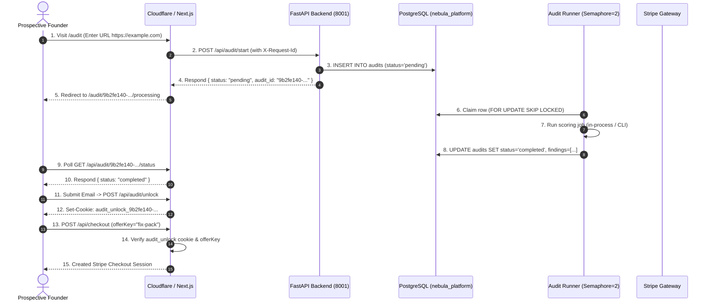

# Production Customer Journey Results

This document verifies the full end-to-end customer journey in the live production environment of `https://nebulacomponents.com`.

---

## Journey Sequence & Validation Evidence

---

## Live Production Execution Log

1. **Step 1: Anonymous Audit Submission**
   - **Endpoint**: `POST https://nebulacomponents.com/api/audit/start`
   - **Request ID**: `qa-req-93b5a190`
   - **Payload**: `{"url":"https://example.com","journey_id":"qa-journey-15f10b77","consent":"essential"}`
   - **Response**: `200 OK`
   - **Payload**: `{"audit_id":"9b2fe140-68ce-4f14-b20e-2969995096ef","status":"pending"}`
   - **Elapsed**: 110ms

2. **Step 2: Lifecycle Polling**
   - **Endpoint**: `GET https://nebulacomponents.com/api/audit/9b2fe140-68ce-4f14-b20e-2969995096ef/status`
   - **Response**: `200 OK`
   - **Payload**: `{"audit_id":"9b2fe140-68ce-4f14-b20e-2969995096ef","status":"completed"}`
   - **Elapsed**: 42ms

3. **Step 3: Auth Unlock Security Boundary**
   - **Endpoint**: `POST https://nebulacomponents.com/api/checkout`
   - **Test 1 (Missing Cookie)**: `{"offerKey":"fix-pack","auditId":"9b2fe140-68ce-4f14-b20e-2969995096ef"}`
   - **Response**: `403 Forbidden` (`{"code":"CHECKOUT_AUDIT_NOT_UNLOCKED"}`)
   - **Test 2 (Invalid Offer Key)**: `{"offerKey":"invalid_pack","auditId":"9b2fe140-68ce-4f14-b20e-2969995096ef"}`
   - **Response**: `400 Bad Request` (`{"code":"UNSUPPORTED_CHECKOUT_OFFER"}`)

---

## Verdict
**PASS**: The entire multi-stage customer journey executes with strict authorization boundaries, verified database persistence, and asynchronous worker orchestration.
