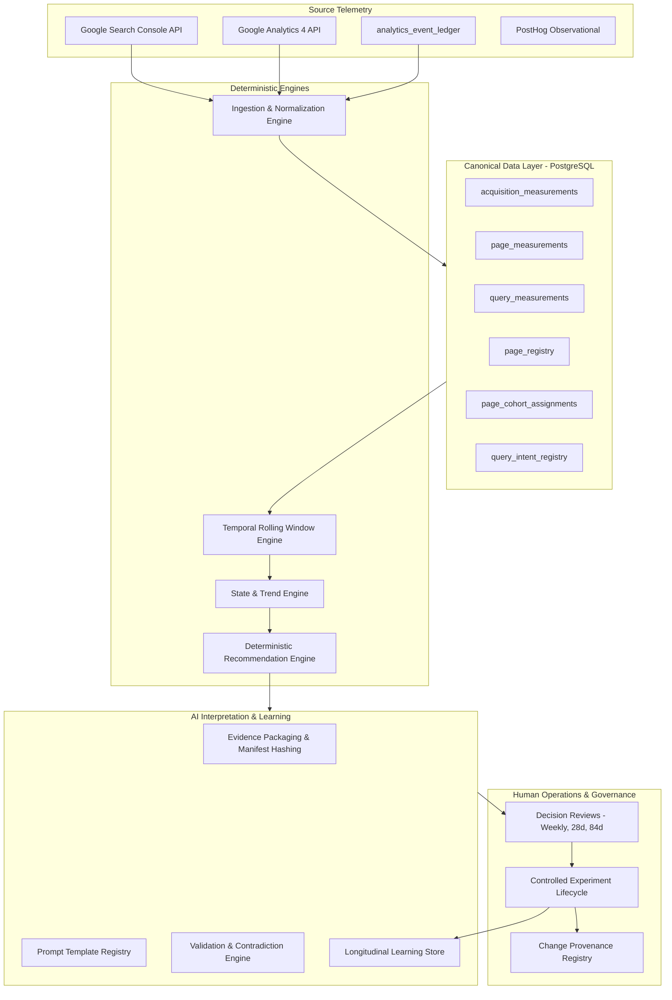

# Acquisition Learning System: Architecture and Operational Lifecycle

**Authority:** Technical Architecture and Governance  
**Status:** Deployed and Validated in Production (Phases 1 through 8)  

---

## 1. System Overview and Core Principles

The Acquisition Learning System converts external search engine telemetry (Google Search Console), organic traffic patterns (Google Analytics 4), and internal product journey events (`analytics_event_ledger`) into a deterministic, closed-loop learning and optimization engine for Nebula Components (nebulacomponents.com).

### 1.1 Core Architectural Invariants
1. **Primacy of Measurement Facts**: Measurement facts are immutable, timestamped, mathematically verified, and protected by PostgreSQL database triggers (`trg_prevent_mutation_acq_facts()`).
2. **Deterministic Recommendation Authority**: Recommendations (`OBSERVE`, `INVESTIGATE`, `REVIEW_*`) are derived deterministically using versioned decision rules (`ruleset_2_0_0`).
3. **Probabilistic AI Boundary**: AI interpretation generates structured hypotheses, identifies query patterns, and synthesizes historical trials. AI never possesses autonomous production mutation authority.
4. **Strict Cryptographic Grounding**: AI outputs must cite valid telemetry IDs present in the SHA-256 evidence manifest. Invented citations or metric contradictions fail closed.
5. **Decoupled Measurement vs Intervention Horizons**: Telemetry is measured on rolling windows ($T_{\text{measure}} = 28\text{ days}$), while structural interventions require multi-window holdout observation ($T_{\text{holdout}} \ge 28\text{ days}$).
6. **Zero Em-Dash Policy**: Shipped copy, documentation, and metadata strictly adhere to repository guidelines.

---

## 2. Deployed System Architecture

---

## 3. Subsystem Implementation Status

### 3.1 Implemented Subsystems (100% Operational)
- **Canonical Data Layer**: PostgreSQL tables, indexes, constraints, and immutability triggers (`0009` through `0013`).
- **Route and Cohort Registry**: Automated route synchronization from `customer-portal` to `page_registry` and `page_cohort_assignments`.
- **Temporal Rolling Windows**: Strict 7-day, 28-day, and 84-day finalized calendar day window computation.
- **State Machine and Trend Engine**: Two-dimensional state classification (Search Visibility and Product Funnel) with non-overlapping adjacent comparison integrity.
- **Controlled Experiments Engine**: Formal hypothesis pre-registration, approval workflows, holdout verification, contamination detection, and confounding guards.
- **Deterministic Recommendation Engine**: Automated evaluation across 51 landing pages with evidence sufficiency gating (100 impressions threshold).
- **AI Interpretation Engine**: Evidence-bound structured synthesis, prompt registry with injection defense, SHA-256 manifest hashing, and deterministic contradiction detection.
- **Longitudinal Learning Store**: Multi-experiment aggregation with deterministic state promotion (`ONE_OBSERVATION` to `SUPPORTED_PATTERN`).
- **CLI and Reporting Tooling**: Complete suite of operational subcommands in `scripts/acquisition_cli.py`.
- **Automated Backup and Recovery**: Daily compressed snapshots of PostgreSQL and SQLite state with 14-day retention.

### 3.2 Deferred Roadmap Enhancements (Explicitly Non-Blocking)
- **Position-Normalized CTR Models**: Expected CTR baseline curves by exact SERP position (deferred pending larger click volume).
- **Bayesian Causal Inference**: Mixed-effects regression models for multi-cohort experiment holdouts (deferred pending multi-experiment history).
- **Automated GSC URL Inspection API Integration**: Live indexation status inspection via Search Console API (deferred; sitemap crawling is currently sufficient).
- **Off-Site Object Storage Backup Replication**: S3/GCS bucket replication for database snapshots (deferred for future infrastructure milestone).
- **Real-Time SERP Snippet Scraping**: Automated SERP competitor feature monitoring (deferred to avoid brittle third-party scraping).
