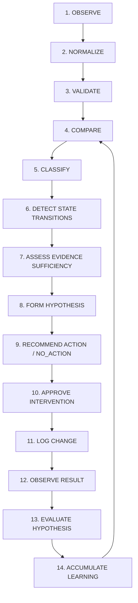
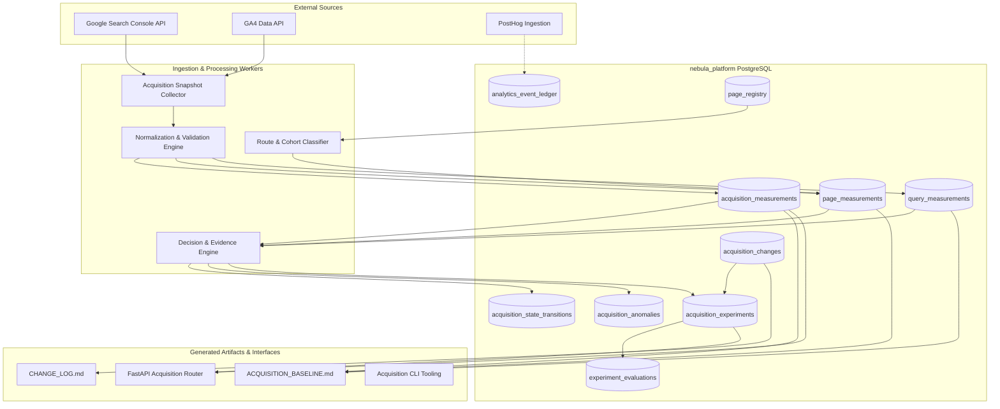

# Acquisition Learning System: Architecture & Operational Lifecycle

**Phase:** Phase 2 (Architecture, Measurement Model, State Machine, and Decision Semantics)  
**Date:** September 2, 2026  
**Status:** Approved Specification  
**Authority:** Technical Architecture & Governance  

---

## 1. Executive Summary & Design Principles

The Acquisition Learning System converts external search engine observations (Google Search Console), organic traffic patterns (Google Analytics 4), and internal product journey telemetry (`analytics_event_ledger`) into a deterministic, closed-loop learning and optimization engine.

### 1.1 Core Architectural Invariants

1. **Separation of Facts from Recommendations:**  
   Measurement facts are immutable, timestamped, and mathematically verified. The recommendation and hypothesis engine consumes measurement facts but cannot alter, synthesize, or fabricate underlying data.
2. **AI Interpretation is Not Measurement Authority:**  
   LLM agents and algorithmic heuristics propose hypotheses and diagnostic reviews, but ground truth resides exclusively in verified database tables (`acquisition_measurements`, `page_measurements`, `query_measurements`).
3. **Reconstructability & Provenance:**  
   Every metric, cohort aggregation, and decision must be 100% reconstructable from its raw input payload, measurement envelope, commit hash, and schema version.
4. **Decoupled Measurement and Intervention Frequencies:**  
   Observation and data collection happen continuously on daily/weekly cadences ($T_{\text{measure}} = 1\text{ day} \text{ or } 7\text{ days}$), while interventions and content evaluations operate on multi-week horizons ($T_{\text{intervene}} \ge 28\text{ days}$). Measurement frequency does not equal intervention frequency.
5. **No Parallel Infrastructure:**  
   The system builds on the established PostgreSQL cluster (`nebula_platform`), existing service account OAuth integrations, Next.js sitemap definitions, and standard `uv run` cron execution patterns.

---

## 2. The 13-Stage Acquisition Learning Lifecycle

The system operates across thirteen logically isolated, sequential stages:

### Stage Descriptions

1. **OBSERVE:** Ingest raw payloads from external source APIs (GSC Search Analytics, GA4 Data API v1beta) and internal ledgers. Preserve source-native timezones, raw query strings, and pagination metadata.
2. **NORMALIZE:** Transform raw payloads into canonical time representations (UTC calendar windows), resolve page routes to canonical URLs (`https://nebulacomponents.com/...`), and extract URL query parameters.
3. **VALIDATE:** Execute data quality SLOs: check for API token quotas, verify GSC 3-day data lag completion, enforce payload non-emptiness, and detect anomalies.
4. **COMPARE:** Calculate delta vectors against baseline periods (7-day, 28-day, 84-day windows) using identical calculation definitions.
5. **CLASSIFY:** Assign pages and queries to deterministic cohorts using the canonical `page_registry` and route hierarchy.
6. **DETECT STATE TRANSITIONS:** Evaluate page and query positions across the two-dimensional state machine (Search Visibility Dimension and Product Funnel Dimension).
7. **ASSESS EVIDENCE SUFFICIENCY:** Run configurable statistical and sample-size gates (e.g. minimum impression thresholds, finalization status, non-zero conversion history) to prevent premature action on noise.
8. **FORM HYPOTHESIS:** Generate falsifiable hypotheses with explicit expected metric deltas, directionality, and required evaluation time horizons.
9. **RECOMMEND ACTION / NO_ACTION:** Map verified conditions to deterministic intervention classes (e.g. `NO_CHANGE`, `REVIEW_SERP_PRESENTATION`, `EXPAND_ADJACENCY`).
10. **APPROVE INTERVENTION:** Require human review (or strict policy gating) before any site content, metadata, or schema changes are scheduled.
11. **LOG CHANGE:** Record the intervention immutably in `acquisition_changes` with deployed commit hashes, affected cohorts, pre-change measurement IDs, and target evaluation dates.
12. **OBSERVE RESULT:** Ingest post-intervention performance after the mandatory observation window ($T \ge 28\text{ days}$) has fully elapsed and finalized.
13. **EVALUATE HYPOTHESIS:** Compare post-intervention metrics against the pre-change baseline; classify outcome into `SUPPORTED`, `PARTIALLY_SUPPORTED`, `NOT_SUPPORTED`, `INCONCLUSIVE`, `CONFOUNDED`, or `REGRESSED`.
14. **ACCUMULATE LEARNING:** Persist structured learning outcomes to `experiment_evaluations` and update the global learning corpus for future decision weighting.

---

## 3. System Component Architecture

---

## 4. Architectural Boundaries & Data Separation

### 4.1 Internal User Journey vs External Acquisition Observations
- **User / Product Events:** Recorded in real-time in `analytics_event_ledger`. Represents discrete visitor actions (e.g. `audit_url_submitted`, `checkout_started`, `purchase_completed`).
- **Acquisition Observations:** Recorded in scheduled batches in `acquisition_measurements`, `page_measurements`, and `query_measurements`. Represents aggregate time-window observations from external search engines and analytics platforms.
- **Integration Point:** `landing_path`, `referrer_class`, and `utm_source` in `analytics_event_ledger` provide the bridge linking external search entries to internal journey conversion paths.

### 4.2 Storage Authority
- **Authoritative Store:** PostgreSQL (`nebula_platform`) on port 5433.
- **Generated Representations:** Markdown baseline files (`ACQUISITION_BASELINE.md`), change logs (`CHANGE_LOG.md`), and dashboard summaries are derived views generated from PostgreSQL records.

---

## 5. Security, Secrets, and Execution Environment

- **Database Access:** Local Unix domain socket (`/var/run/postgresql`) or port 5433 using peer/postgres authentication.
- **OAuth Credentials:** Service account keys stored in `~/.hermes/.env` or `~/.claude/skills/seo/scripts/`. Never committed to the git repository.
- **Cron Execution:** Runs via `/home/mike/.local/bin/uv run --project /home/mike/nebula python ...` wrapped with `flock` file locking and exit traps to prevent concurrent executions.
