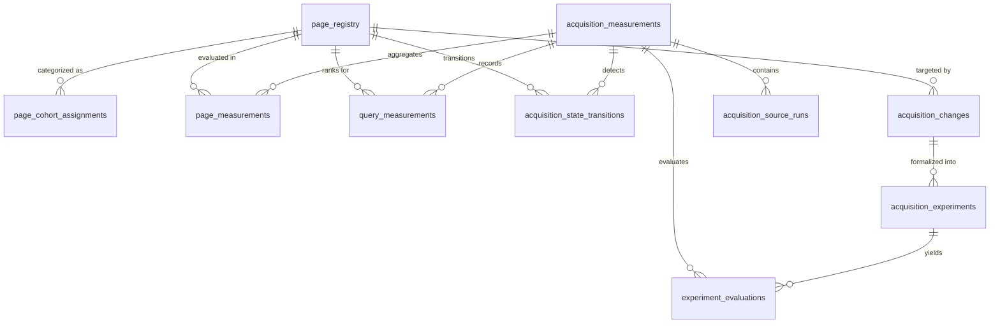

# Acquisition Learning System: PostgreSQL Data Model & Schema Specification

**Phase:** Phase 2 (Architecture, Measurement Model, State Machine, and Decision Semantics)  
**Date:** September 2, 2026  
**Status:** Approved Specification  
**Database:** `nebula_platform` (PostgreSQL 16 on port 5433)  

---

## 1. Executive Overview

This document specifies the concrete relational database schema for the Acquisition Learning System in `nebula_platform`. It establishes structured, immutable, versioned persistence for acquisition runs, page measurements, query measurements, state transitions, changes, and experiment evaluations.

---

## 2. Entity-Relationship Architecture



---

## 3. Concrete Table Definitions (DDL)

### 3.1 Page Registry & Cohorts

```sql
-- 1. Canonical Page Registry
CREATE TABLE IF NOT EXISTS page_registry (
    id UUID PRIMARY KEY DEFAULT gen_random_uuid(),
    canonical_url TEXT NOT NULL UNIQUE,
    route_path TEXT NOT NULL UNIQUE,
    route_pattern TEXT NOT NULL,
    route_type TEXT NOT NULL CHECK (route_type IN ('static', 'dynamic', 'utility', 'conversion', 'gated')),
    sitemap_priority NUMERIC(3,2) CHECK (sitemap_priority >= 0.0 AND sitemap_priority <= 1.0),
    is_indexable BOOLEAN NOT NULL DEFAULT TRUE,
    first_seen_at TIMESTAMPTZ NOT NULL DEFAULT NOW(),
    retired_at TIMESTAMPTZ,
    is_active BOOLEAN NOT NULL DEFAULT TRUE,
    created_at TIMESTAMPTZ NOT NULL DEFAULT NOW(),
    updated_at TIMESTAMPTZ NOT NULL DEFAULT NOW()
);

CREATE INDEX idx_page_reg_path ON page_registry(route_path);
CREATE INDEX idx_page_reg_active ON page_registry(is_active) WHERE is_active = TRUE;

-- 2. Declarative Page Cohort Assignments
CREATE TABLE IF NOT EXISTS page_cohort_assignments (
    id UUID PRIMARY KEY DEFAULT gen_random_uuid(),
    page_id UUID NOT NULL REFERENCES page_registry(id) ON DELETE CASCADE,
    cohort_name TEXT NOT NULL CHECK (cohort_name IN (
        'problem_intent',
        'commercial_comparison',
        'category',
        'vertical_use_case',
        'resources',
        'teardown_index',
        'individual_teardown',
        'case_study',
        'product_core',
        'checkout',
        'utility_legal',
        'other'
    )),
    cohort_version TEXT NOT NULL DEFAULT '2.0.0',
    assigned_by TEXT NOT NULL DEFAULT 'declarative_registry',
    assigned_at TIMESTAMPTZ NOT NULL DEFAULT NOW(),
    valid_until TIMESTAMPTZ,
    is_current BOOLEAN NOT NULL DEFAULT TRUE,
    UNIQUE(page_id, cohort_name, cohort_version)
);

CREATE INDEX idx_cohort_page ON page_cohort_assignments(page_id) WHERE is_current = TRUE;
CREATE INDEX idx_cohort_name ON page_cohort_assignments(cohort_name) WHERE is_current = TRUE;
```

---

### 3.2 Acquisition Measurements & Ingestion Snapshots

```sql
-- 3. Acquisition Measurements (Master Measurement Envelope)
CREATE TABLE IF NOT EXISTS acquisition_measurements (
    id TEXT PRIMARY KEY, -- e.g. meas_01J6X...
    measurement_version INTEGER NOT NULL DEFAULT 2,
    generated_at TIMESTAMPTZ NOT NULL DEFAULT NOW(),
    
    requested_period_start DATE NOT NULL,
    requested_period_end DATE NOT NULL,
    effective_period_start DATE NOT NULL,
    effective_period_end DATE NOT NULL,
    
    source_native_period_start DATE NOT NULL,
    source_native_period_end DATE NOT NULL,
    source_native_timezone TEXT NOT NULL,
    canonical_timezone TEXT NOT NULL DEFAULT 'UTC',
    window_days INTEGER NOT NULL,
    
    -- Macro Search Visibility Metrics
    gsc_total_impressions INTEGER NOT NULL DEFAULT 0,
    gsc_total_clicks INTEGER NOT NULL DEFAULT 0,
    gsc_aggregate_position NUMERIC(5,2) NOT NULL DEFAULT 0.0,
    dimensioned_impression_weighted_position NUMERIC(5,2) NOT NULL DEFAULT 0.0,
    unique_visible_pages INTEGER NOT NULL DEFAULT 0,
    unique_visible_queries INTEGER NOT NULL DEFAULT 0,
    
    -- Position Buckets
    pos_bucket_1_10 INTEGER NOT NULL DEFAULT 0,
    pos_bucket_11_20 INTEGER NOT NULL DEFAULT 0,
    pos_bucket_21_30 INTEGER NOT NULL DEFAULT 0,
    pos_bucket_31_50 INTEGER NOT NULL DEFAULT 0,
    pos_bucket_51_plus INTEGER NOT NULL DEFAULT 0,
    
    -- Organic Search Traffic (GA4)
    ga4_organic_sessions INTEGER NOT NULL DEFAULT 0,
    ga4_organic_users INTEGER NOT NULL DEFAULT 0,
    ga4_search_entry_sessions INTEGER NOT NULL DEFAULT 0,
    ga4_downstream_checkout_sessions INTEGER NOT NULL DEFAULT 0,
    
    -- Funnel Counts from Canonical Ledger
    internal_audit_started INTEGER NOT NULL DEFAULT 0,
    internal_audit_completed INTEGER NOT NULL DEFAULT 0,
    internal_checkout_started INTEGER NOT NULL DEFAULT 0,
    internal_purchases INTEGER NOT NULL DEFAULT 0,
    
    -- Metadata Envelope
    source_filters JSONB NOT NULL DEFAULT '{}'::jsonb,
    source_query_parameters JSONB NOT NULL DEFAULT '{}'::jsonb,
    metric_definition_version TEXT NOT NULL,
    cohort_definition_version TEXT NOT NULL,
    measurement_code_commit TEXT NOT NULL,
    application_commit TEXT,
    
    data_completeness_status TEXT NOT NULL CHECK (data_completeness_status IN ('COMPLETE', 'PARTIAL', 'INSUFFICIENT', 'BLOCKED')),
    source_finalization_status TEXT NOT NULL CHECK (source_finalization_status IN ('FINAL', 'PROVISIONAL', 'STALE')),
    known_anomalies TEXT[] NOT NULL DEFAULT '{}',
    known_blockers TEXT[] NOT NULL DEFAULT '{}',
    
    created_at TIMESTAMPTZ NOT NULL DEFAULT NOW()
);

CREATE INDEX idx_acq_meas_dates ON acquisition_measurements(effective_period_start, effective_period_end);
CREATE INDEX idx_acq_meas_window ON acquisition_measurements(window_days, generated_at DESC);

-- 4. Ingestion Source Runs (Audit Trail of Raw API Calls)
CREATE TABLE IF NOT EXISTS acquisition_source_runs (
    id UUID PRIMARY KEY DEFAULT gen_random_uuid(),
    measurement_id TEXT NOT NULL REFERENCES acquisition_measurements(id) ON DELETE CASCADE,
    source_system TEXT NOT NULL CHECK (source_system IN ('gsc', 'ga4', 'internal_ledger')),
    source_property TEXT NOT NULL,
    requested_at TIMESTAMPTZ NOT NULL DEFAULT NOW(),
    response_status INTEGER NOT NULL,
    payload_hash TEXT NOT NULL,
    rows_returned INTEGER NOT NULL DEFAULT 0,
    quota_consumed INTEGER,
    quota_remaining INTEGER,
    execution_duration_ms INTEGER NOT NULL,
    error_message TEXT
);
```

---

### 3.3 Page & Query Measurements

```sql
-- 5. Per-Page Measurement Snapshots
CREATE TABLE IF NOT EXISTS page_measurements (
    id UUID PRIMARY KEY DEFAULT gen_random_uuid(),
    measurement_id TEXT NOT NULL REFERENCES acquisition_measurements(id) ON DELETE CASCADE,
    page_id UUID NOT NULL REFERENCES page_registry(id) ON DELETE CASCADE,
    cohort_name TEXT NOT NULL,
    
    impressions INTEGER NOT NULL DEFAULT 0,
    clicks INTEGER NOT NULL DEFAULT 0,
    ctr NUMERIC(5,4) NOT NULL DEFAULT 0.0,
    best_position NUMERIC(5,2) NOT NULL DEFAULT 0.0,
    weighted_avg_position NUMERIC(5,2) NOT NULL DEFAULT 0.0,
    position_bucket TEXT NOT NULL CHECK (position_bucket IN ('POS_1_10', 'POS_11_20', 'POS_21_30', 'POS_31_50', 'POS_51_PLUS', 'UNSEEN')),
    
    ga4_organic_entry_sessions INTEGER NOT NULL DEFAULT 0,
    ga4_organic_attributed_sessions INTEGER NOT NULL DEFAULT 0,
    
    internal_audit_starts INTEGER NOT NULL DEFAULT 0,
    internal_audit_completions INTEGER NOT NULL DEFAULT 0,
    
    created_at TIMESTAMPTZ NOT NULL DEFAULT NOW(),
    UNIQUE(measurement_id, page_id)
);

CREATE INDEX idx_pm_meas_cohort ON page_measurements(measurement_id, cohort_name);
CREATE INDEX idx_pm_page_time ON page_measurements(page_id, created_at DESC);

-- 6. Per-Query Measurement Snapshots
CREATE TABLE IF NOT EXISTS query_measurements (
    id UUID PRIMARY KEY DEFAULT gen_random_uuid(),
    measurement_id TEXT NOT NULL REFERENCES acquisition_measurements(id) ON DELETE CASCADE,
    page_id UUID NOT NULL REFERENCES page_registry(id) ON DELETE CASCADE,
    query_text TEXT NOT NULL,
    
    impressions INTEGER NOT NULL DEFAULT 0,
    clicks INTEGER NOT NULL DEFAULT 0,
    ctr NUMERIC(5,4) NOT NULL DEFAULT 0.0,
    position NUMERIC(5,2) NOT NULL DEFAULT 0.0,
    
    query_intent_class TEXT CHECK (query_intent_class IN ('problem', 'brand', 'comparison', 'category', 'navigational', 'informational', 'unclassified')),
    is_anonymized_subset BOOLEAN NOT NULL DEFAULT FALSE,
    
    created_at TIMESTAMPTZ NOT NULL DEFAULT NOW(),
    UNIQUE(measurement_id, page_id, query_text)
);

CREATE INDEX idx_qm_meas_query ON query_measurements(measurement_id, query_text);
CREATE INDEX idx_qm_page_query ON query_measurements(page_id, query_text);
```

---

### 3.4 State Transitions, Anomalies, and Changes

```sql
-- 7. Acquisition State Transitions
CREATE TABLE IF NOT EXISTS acquisition_state_transitions (
    id UUID PRIMARY KEY DEFAULT gen_random_uuid(),
    page_id UUID NOT NULL REFERENCES page_registry(id) ON DELETE CASCADE,
    measurement_id TEXT NOT NULL REFERENCES acquisition_measurements(id) ON DELETE CASCADE,
    dimension TEXT NOT NULL CHECK (dimension IN ('search_visibility', 'product_journey')),
    from_state TEXT NOT NULL,
    to_state TEXT NOT NULL,
    transition_type TEXT NOT NULL CHECK (transition_type IN ('PROGRESSION', 'REGRESSION', 'MAINTAINED', 'INITIAL')),
    transition_reason TEXT NOT NULL,
    occurred_at TIMESTAMPTZ NOT NULL DEFAULT NOW()
);

CREATE INDEX idx_ast_page_time ON acquisition_state_transitions(page_id, occurred_at DESC);

-- 8. Structured Anomaly Registry
CREATE TABLE IF NOT EXISTS acquisition_anomalies (
    id TEXT PRIMARY KEY, -- e.g. anom_01J...
    anomaly_type TEXT NOT NULL,
    description TEXT NOT NULL,
    source_system TEXT NOT NULL,
    severity TEXT NOT NULL CHECK (severity IN ('LOW', 'MEDIUM', 'HIGH', 'CRITICAL')),
    status TEXT NOT NULL CHECK (status IN ('OPEN', 'INVESTIGATING', 'MITIGATED', 'RESOLVED', 'ACCEPTED_LIMITATION', 'KNOWN_ATTRIBUTION_BEHAVIOR')),
    affected_pages UUID[] DEFAULT '{}',
    affected_metrics TEXT[] NOT NULL DEFAULT '{}',
    detected_at TIMESTAMPTZ NOT NULL DEFAULT NOW(),
    mitigation_notes TEXT,
    resolved_at TIMESTAMPTZ
);

-- 9. Acquisition Site Changes & Deployments
CREATE TABLE IF NOT EXISTS acquisition_changes (
    id TEXT PRIMARY KEY, -- e.g. chg_01J...
    change_type TEXT NOT NULL CHECK (change_type IN ('CONTENT_REWRITE', 'SCHEMA_UPDATE', 'INTERNAL_LINKING', 'TITLE_META', 'NEW_PAGE', 'RETIRED_PAGE', 'TECHNICAL_SEO', 'EXPERIMENT')),
    summary TEXT NOT NULL,
    affected_page_ids UUID[] NOT NULL DEFAULT '{}',
    affected_cohorts TEXT[] NOT NULL DEFAULT '{}',
    deployed_commit TEXT NOT NULL,
    deployed_at TIMESTAMPTZ NOT NULL DEFAULT NOW(),
    expected_impact TEXT NOT NULL CHECK (expected_impact IN ('positive', 'neutral', 'investigative', 'defensive')),
    pre_change_measurement_id TEXT REFERENCES acquisition_measurements(id),
    min_observation_days INTEGER NOT NULL DEFAULT 28,
    evaluation_due_date DATE NOT NULL,
    logged_by TEXT NOT NULL DEFAULT 'system',
    created_at TIMESTAMPTZ NOT NULL DEFAULT NOW()
);

-- 10. Acquisition Experiments & Hypotheses
CREATE TABLE IF NOT EXISTS acquisition_experiments (
    id TEXT PRIMARY KEY, -- e.g. exp_01J...
    change_id TEXT NOT NULL REFERENCES acquisition_changes(id) ON DELETE CASCADE,
    hypothesis_statement TEXT NOT NULL,
    target_metric TEXT NOT NULL,
    expected_direction TEXT NOT NULL CHECK (expected_direction IN ('INCREASE', 'DECREASE', 'MAINTAIN')),
    expected_magnitude NUMERIC(8,2),
    pre_metric_value NUMERIC(8,2) NOT NULL,
    approval_status TEXT NOT NULL CHECK (approval_status IN ('DRAFT', 'APPROVED', 'RUNNING', 'EVALUATED', 'CANCELLED')),
    approved_by TEXT,
    started_at TIMESTAMPTZ NOT NULL DEFAULT NOW(),
    scheduled_evaluation_at TIMESTAMPTZ NOT NULL
);

-- 11. Experiment Evaluations & Accumulated Learning
CREATE TABLE IF NOT EXISTS experiment_evaluations (
    id UUID PRIMARY KEY DEFAULT gen_random_uuid(),
    experiment_id TEXT NOT NULL REFERENCES acquisition_experiments(id) ON DELETE CASCADE,
    post_measurement_id TEXT NOT NULL REFERENCES acquisition_measurements(id) ON DELETE CASCADE,
    outcome TEXT NOT NULL CHECK (outcome IN ('SUPPORTED', 'PARTIALLY_SUPPORTED', 'NOT_SUPPORTED', 'INCONCLUSIVE', 'CONFOUNDED', 'REGRESSED')),
    pre_value NUMERIC(8,2) NOT NULL,
    post_value NUMERIC(8,2) NOT NULL,
    delta_value NUMERIC(8,2) NOT NULL,
    delta_percentage NUMERIC(6,2),
    confidence_level TEXT NOT NULL CHECK (confidence_level IN ('HIGH', 'MEDIUM', 'LOW', 'NONE')),
    synthesis_notes TEXT NOT NULL,
    learning_accumulated JSONB NOT NULL DEFAULT '{}'::jsonb,
    evaluated_at TIMESTAMPTZ NOT NULL DEFAULT NOW()
);
```

---

## 4. Immutability & Safety Guarantees

1. **Append-Only Measurement Tables:**
   `acquisition_measurements`, `page_measurements`, `query_measurements`, and `acquisition_state_transitions` are append-only. No UPDATE or DELETE triggers will be attached in application runtime.
2. **Deterministic Foreign Keys:**
   All measurement records link directly to immutable `measurement_id` identifiers and verified `page_registry` UUIDs.
3. **No Dynamic Table Generation:**
   All acquisition data resides in strict, statically typed relational tables.
