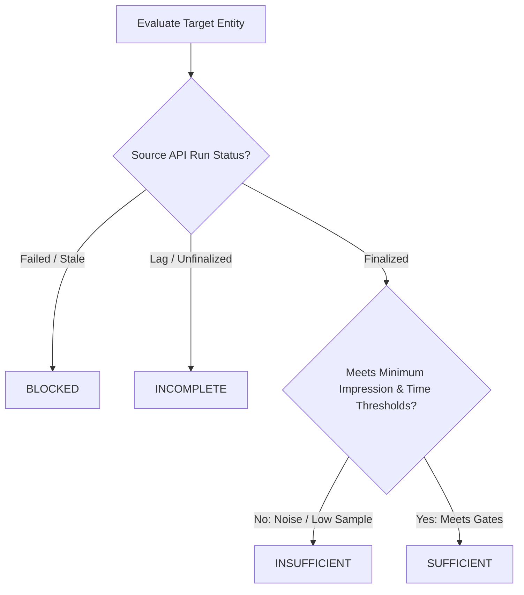
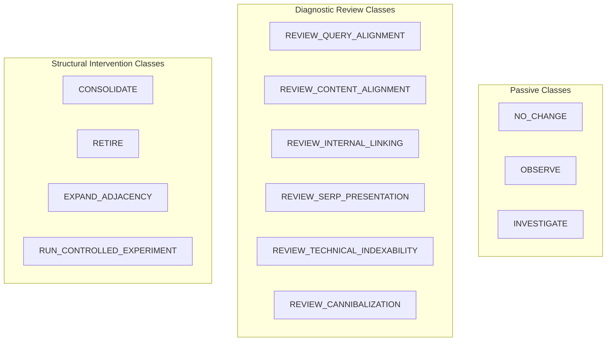

# Acquisition Learning System: Decision Semantics, Evidence Gates & Intervention Rules

**Phase:** Phase 2 (Architecture, Measurement Model, State Machine, and Decision Semantics)  
**Date:** September 2, 2026  
**Status:** Approved Specification  
**Authority:** Technical Architecture & Governance  

---

## 1. Executive Summary & Gating Philosophy

The Acquisition Learning System prevents premature intervention, noise chasing, and content degradation by establishing strict **Evidence Sufficiency Gates** and **Deterministic Recommendation Classes**.

No change may be proposed without mathematical evidence, verified measurement envelopes, and falsifiable hypotheses.

---

## 2. Evidence Sufficiency States

Before any page or cohort condition is evaluated, its evidence state must be formally assessed:



### 2.1 State Definitions

| Evidence State | Criteria & Boundary Rules | Action Permitted |
| :--- | :--- | :--- |
| `SUFFICIENT` | Observation window is `FINAL`, $\ge 28\text{ days}$ holdout has elapsed, total impressions $\ge 100$, and metric trend is statistically distinguishable from zero. | Recommendations, experiments, and content interventions are permitted. |
| `INSUFFICIENT` | Finalized data exists, but total impressions $< 100$, or observed window is $< 28\text{ days}$, or delta is within random noise boundaries ($\pm 5\%$). | Status: `OBSERVE` only. No interventions permitted. |
| `INCOMPLETE` | Ingestion window includes unfinalized data (e.g. data $< 3\text{ days}$ old for GSC), or partial source run detected. | Status: `WAIT_FOR_FINALIZATION`. |
| `BLOCKED` | Source API failed, authentication token expired, or verified critical data anomaly flag active. | Status: `REPAIR_DATA_PIPELINE`. No acquisition analysis allowed. |

---

## 3. Deterministic Intervention Classes

Every automated evaluation outputs one of thirteen strictly defined action classes:



### 3.1 Class Definitions & Trigger Conditions

| Recommendation Class | Trigger Condition & Evidence Rule | Target Output | Expected Metric |
| :--- | :--- | :--- | :--- |
| `NO_CHANGE` | Page is progressing (e.g. ranking improving week-over-week) or stable in `TOP_10`. | Zero modifications. Protect current ranking momentum. | Maintain `best_position` $\le 10.4$. |
| `OBSERVE` | Page is in `INSUFFICIENT` evidence state, or has an active change deployed $< 28\text{ days}$ ago. | Maintain holdout period. Do not touch. | Hold for observation window expiry. |
| `INVESTIGATE` | Sudden metric divergence ($> 30\%$ drop in impressions) without deployed site changes. | Trigger diagnostic scan of indexing, CWV, and manual actions. | Determine external root cause. |
| `REVIEW_SERP_PRESENTATION` | Page is in `TOP_10` or `TOP_20` with high impressions ($\ge 500$) but low CTR ($< 1.0\%$). | Optimize Title tag, meta description, and schema snippet. | Increase SERP CTR by $\ge 0.5\%$. |
| `REVIEW_QUERY_ALIGNMENT` | Page receives high impressions for unexpected search intents outside target keyword scope. | Adjust H1/H2 headings and introductory copy to match actual searcher intent. | Improve query relevance score. |
| `REVIEW_CONTENT_ALIGNMENT` | Page ranks in `POS_51_PLUS` or `TOP_50` with high bounce / low time on page. | Deepen editorial substance, add diagnostic tables, refine answer-first copy. | Advance best position into `TOP_30`. |
| `REVIEW_INTERNAL_LINKING` | Page has strong search relevance but low link equity / orphan status in sitemap. | Add contextual internal links from high-ranking hub pages (`/signals`, `/learning-centre`). | Advance position from `TOP_30` to `TOP_20`. |
| `REVIEW_TECHNICAL_INDEXABILITY`| URL inspection returns `Crawled - currently not indexed` or soft-404 warning. | Repair canonical tags, fix viewport rendering, or remove conflicting headers. | Move URL to `Indexed` state. |
| `REVIEW_CANNIBALIZATION` | Two or more internal URLs compete for the exact same query with split impressions. | Canonicalize, re-target secondary page, or consolidate into primary hub. | Concentrate impressions on canonical URL. |
| `CONSOLIDATE` | Multiple thin pages across a cohort fail to rank independently ($< 10$ impressions). | Merge content into a comprehensive pillar page and 301 redirect old URLs. | Eliminate thin content crawl waste. |
| `RETIRE` | Deprecated tool, outdated comparison, or zero-search utility page. | Remove from sitemap, set HTTP 410 or 301 redirect. | Conserve site crawl budget. |
| `EXPAND_ADJACENCY` | High-performing page identifies recurring related queries that warrant a dedicated deep dive. | Author new standalone page targeting adjacent intent cluster. | Capture adjacent search volume. |
| `RUN_CONTROLLED_EXPERIMENT` | A structural copy or layout hypothesis requires formal pre/post holdout testing. | Create formal experiment record in `acquisition_experiments`. | Pre/post statistical evaluation. |

---

## 4. Grounding Requirements for Recommendations

Every generated recommendation object must include complete cryptographic and measurement grounding:

```json
{
  "recommendation_id": "rec_01J6X9A2B4C6D8E0F2G4H6J8K0",
  "created_at": "2026-09-02T12:00:00.000Z",
  "target_page_id": "9b1deb4d-3b7d-4bad-9bdd-2b0d7b3dcb6d",
  "target_url": "https://nebulacomponents.com/why-is-my-landing-page-not-converting",
  "cohort": "problem_intent",
  "recommendation_class": "REVIEW_SERP_PRESENTATION",
  "evidence_state": "SUFFICIENT",
  "grounding_measurements": [
    "meas_01J6X7B9K2M3N4P5Q6R7S8T9U0",
    "meas_01J6W5A8K1M2N3P4Q5R6S7T8U9"
  ],
  "detected_condition": "Page ranks at best_position 8.2 with 132 impressions over 28 days, but achieved 0 clicks (0.0% CTR). Page 1 visibility without click capture.",
  "reason": "Title tag is generic diagnostic language that lacks compelling intent hook for paid traffic operators.",
  "hypothesis": "Rewriting Title to emphasize evidence-first proof and ad waste diagnosis will improve SERP CTR from 0.0% to >= 1.5% without dropping average position below 10.0.",
  "target_metric": "gsc_clicks",
  "expected_direction": "INCREASE",
  "confidence_score": 0.85,
  "min_observation_period_days": 28,
  "risks": "Risk of transient position re-indexing fluctuation during first 7 days post-deploy.",
  "do_not_change_conditions": [
    "Do not alter URL path or canonical header",
    "Do not change primary H1 message match",
    "Do not modify structured schema types"
  ]
}
```
