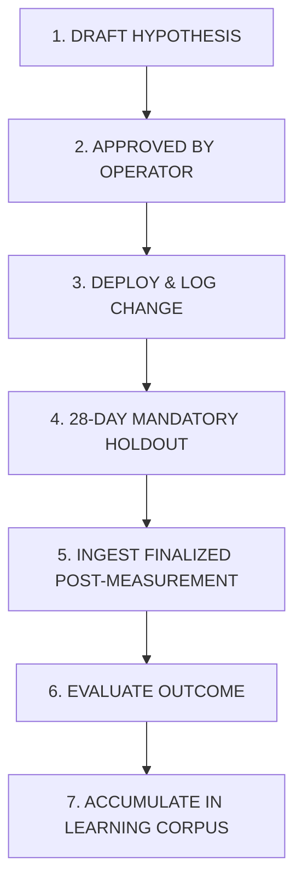

# Acquisition Learning System: Experimentation, Change Logging & Learning Accumulation

**Phase:** Phase 2 (Architecture, Measurement Model, State Machine, and Decision Semantics)  
**Date:** September 2, 2026  
**Status:** Approved Specification  
**Authority:** Technical Architecture & Governance  

---

## 1. Executive Summary & Experimentation Doctrine

In search engine optimization and organic acquisition, rapid continuous modifications create confounded variables and uninterpretable noise. To establish genuine causal learning, the Acquisition Learning System enforces a **Strict Single-Intervention Holdout Model**.

### 1.1 Core Rules

1. **Immutable Hypotheses:**  
   Once an experiment is registered and deployed, its original hypothesis statement, pre-change baseline measurement, and target metrics cannot be modified.
2. **Mandatory Holdout Period:**  
   Every content, metadata, or schema intervention must remain untouched for a minimum observation period of **28 finalized days** ($T_{\text{holdout}} \ge 28\text{ days}$).
3. **No Overlapping Interventions:**  
   A page or cohort with an active, unfinalized experiment cannot undergo additional structural modifications until the active experiment is formally evaluated and closed.
4. **Git-Backed Traceability:**  
   Every experiment is explicitly bound to git commit hashes (`deployed_commit` or `content_commit`), linking code changes directly to database evaluation records.

---

## 2. Experiment Lifecycle & State Flow



---

## 3. Structured Change & Experiment Schemas

### 3.1 Change Registration (`acquisition_changes`)

```json
{
  "change_id": "chg_01J6XB4A2B9C8D7E6F5G4H3J2K",
  "change_type": "TITLE_META",
  "summary": "Optimized SERP Title and meta description for /why-is-my-landing-page-not-converting to target paid ad waste intent.",
  "affected_pages": ["9b1deb4d-3b7d-4bad-9bdd-2b0d7b3dcb6d"],
  "affected_cohorts": ["problem_intent"],
  "deployed_commit": "1e6aeb98c3f7b0a8d9e2f4a5b6c7d8e9f0a1b2c3",
  "deployed_at": "2026-09-02T13:00:00.000Z",
  "expected_impact": "positive",
  "pre_change_measurement_id": "meas_01J6X7B9K2M3N4P5Q6R7S8T9U0",
  "min_observation_days": 28,
  "evaluation_due_date": "2026-10-04",
  "logged_by": "operator_mike"
}
```

### 3.2 Formal Experiment Record (`acquisition_experiments`)

```json
{
  "experiment_id": "exp_01J6XC8K9M2N3P4Q5R6S7T8U9V",
  "change_id": "chg_01J6XB4A2B9C8D7E6F5G4H3J2K",
  "hypothesis_statement": "Refining SERP Title with an evidence-first ad burn hook will increase clicks from 0 to >= 3 over 28 days while maintaining top 10 position.",
  "target_metric": "gsc_total_clicks",
  "expected_direction": "INCREASE",
  "expected_magnitude": 3.0,
  "pre_metric_value": 0.0,
  "approval_status": "APPROVED",
  "approved_by": "operator_mike",
  "started_at": "2026-09-02T13:00:00.000Z",
  "scheduled_evaluation_at": "2026-10-04T04:00:00.000Z"
}
```

---

## 4. Evaluation Classification Framework

When the evaluation date arrives and post-change measurements are finalized, the outcome is classified into one of six mutually exclusive categories:

| Evaluation Outcome | Mathematical / Evidence Definition | System Action & Learning Invariant |
| :--- | :--- | :--- |
| `SUPPORTED` | Target metric improved in the expected direction by $\ge 80\%$ of expected magnitude, and secondary metrics did not regress. | Log successful pattern to learning corpus. Maintain change. |
| `PARTIALLY_SUPPORTED` | Target metric improved in expected direction by $20\% \text{ to } 79\%$ of expected magnitude without secondary regression. | Log qualified success. Identify potential refinements. |
| `NOT_SUPPORTED` | Target metric showed zero statistically significant change ($\pm 5\%$ delta). | Log null result. Do not repeat identical intervention pattern on similar cohort pages. |
| `REGRESSED` | Target metric or core ranking position moved in an adverse direction ($> 10\%$ drop in ranking or impressions). | Trigger immediate rollback review or diagnostic investigation. |
| `CONFOUNDED` | External site-wide factor (e.g. Google core algorithm update, broad DNS outage, accidental sitewide robots.txt block) occurred during the observation window. | Mark experiment invalid. Re-baseline required. |
| `INCONCLUSIVE` | Sample size remained below minimum statistical threshold ($< 50$ impressions throughout 28 days). | Extend observation period or consolidate into higher-volume entity. |

---

## 5. Evaluation Record Example

```json
{
  "evaluation_id": "eval_01J7Y1A2B3C4D5E6F7G8H9J0K1",
  "experiment_id": "exp_01J6XC8K9M2N3P4Q5R6S7T8U9V",
  "post_measurement_id": "meas_01J7X9B8K1M2N3P4Q5R6S7T8U9",
  "outcome": "SUPPORTED",
  "pre_value": 0.0,
  "post_value": 4.0,
  "delta_value": 4.0,
  "delta_percentage": null,
  "confidence_level": "HIGH",
  "synthesis_notes": "SERP title rewrite generated 4 clicks from 145 impressions (2.75% CTR) while position improved from 8.2 to 7.6. Evidence supports the ad waste hook for problem_intent cohort.",
  "learning_accumulated": {
    "cohort": "problem_intent",
    "effective_tactic": "evidence_first_ad_burn_title",
    "observed_ctr_lift": 0.0275,
    "generalizability": "high_for_diagnostic_pages"
  },
  "evaluated_at": "2026-10-04T04:15:00.000Z"
}
```
