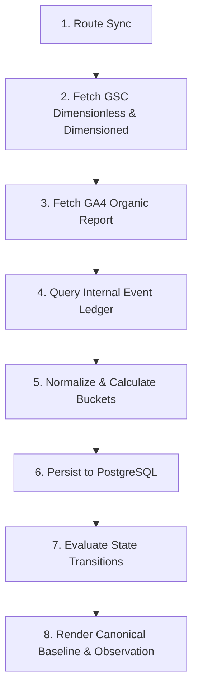

# Acquisition Learning System: Automated Source Ingestion & Pipeline Specification

**Phase:** Phase 4 (Automated Ingestion, Route Synchronization, Rolling Windows, State Evaluation, and Trend Computation)  
**Date:** September 2, 2026  
**Status:** Approved & Implemented  
**Execution Script:** `scripts/acquisition_cli.py` / `scripts/update_acquisition_baseline.py`  
**Database:** `nebula_platform` (PostgreSQL 16 on port 5433)  

---

## 1. Executive Summary

This document specifies the end-to-end automated ingestion pipeline for the Acquisition Learning System. The pipeline ingests external search engine observations from Google Search Console, organic traffic reports from Google Analytics 4, and authoritative financial/conversion events from PostgreSQL `analytics_event_ledger`.

---

## 2. Ingestion Pipeline Stages

---

## 3. Google Search Console Ingestion Mechanics

### 3.1 Macro Sitewide Query (Dimensionless Aggregate)
- **API Call:** `service.searchanalytics().query(siteUrl=..., body={"dimensions": [], "dataState": "final"})`
- **Purpose:** Authoritative macro sitewide metrics (`gsc_total_impressions`, `gsc_total_clicks`, `gsc_aggregate_position`).
- **Google Privacy Anonymization:** Preserves true sitewide volume without query censoring bias.

### 3.2 Page-Level & Query-Level Queries (Dimensioned)
- **API Call:** `dimensions: ["query", "page"]`
- **Purpose:** Population of `page_measurements` and `query_measurements`.
- **Constraint:** Dimensioned query rows are explicitly flagged as `is_anonymized_subset = TRUE`. The system never reconstructs sitewide totals from dimensioned query rows.

---

## 4. Google Analytics 4 Traffic & Attribution Separation

GA4 organic sessions are ingested and strictly separated by route indexability:
- **`ga4_search_entry_sessions`:** Sessions landing on indexable public routes (e.g. `/`, `/signals`, `/why-is-my-landing-page-not-converting`).
- **`ga4_downstream_checkout_sessions`:** Sessions landing on conversion/utility surfaces (`/checkout`), categorized under `KNOWN_ATTRIBUTION_BEHAVIOR`.

---

## 5. Internal Conversion Authority

Conversion events are retrieved directly from `nebula_platform.analytics_event_ledger`:
- `audit_started` ($N_{\text{starts}}$)
- `audit_completed` ($N_{\text{completes}}$)
- `checkout_started` ($N_{\text{checkouts}}$)
- `purchase_completed` ($N_{\text{purchases}}$)

Third-party analytics (GA4/PostHog) never override platform ledger counts.

---

## 6. Metric-Level Failure Isolation & Safe Degradation

If an individual data source fails during a scheduled run:
- **GA4 Fails, GSC Healthy:** GSC search visibility metrics persist; GA4 columns are marked `NULL` / incomplete; internal ledger conversions persist.
- **GSC Fails:** Search visibility calculations are halted and marked `BLOCKED`.
- **Zero Substitution Prohibited:** A failed source run never produces false `0` or `0.0` values.
