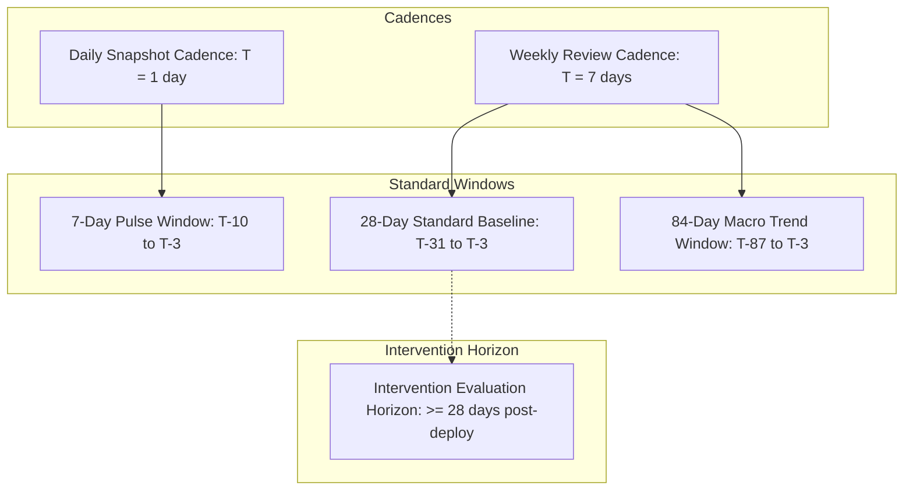

# Acquisition Learning System: Measurement Model & Metric Specifications

**Phase:** Phase 2 (Architecture, Measurement Model, State Machine, and Decision Semantics)  
**Date:** September 2, 2026  
**Status:** Approved Specification  
**Authority:** Technical Architecture & Governance  

---

## 1. Executive Overview

This specification establishes the canonical measurement contract for the Acquisition Learning System. It resolves historical semantic ambiguities (including the 64.3 vs 65.6 position discrepancy), formalizes timezone and window alignments, distinguishes search-entry landing from downstream session attribution, and defines the complete measurement envelope.

---

## 2. Canonical Metric Semantics & Definitions

### 2.1 Search Visibility Metrics

| Metric Name | Mathematical Definition | Data Source | Semantic Scope & Interpretation |
| :--- | :--- | :--- | :--- |
| `gsc_total_impressions` | $\sum \text{impressions}$ from dimensionless aggregate query | GSC API (`dimensions: []`) | Total SERP impressions across all queries, including anonymized/rare queries. |
| `gsc_total_clicks` | $\sum \text{clicks}$ from dimensionless aggregate query | GSC API (`dimensions: []`) | Total search clicks across all queries. GSC anonymization does not suppress dimensionless clicks. |
| `gsc_aggregate_position` | Direct scalar returned by dimensionless query | GSC API (`dimensions: []`) | **Canonical Sitewide Search-Position Metric.** Represents Google's official aggregate ranking across the entire site including anonymized search volume. (Historical value: 65.6). |
| `dimensioned_impression_weighted_position` | $\frac{\sum_{i} (\text{impressions}_i \times \text{position}_i)}{\sum_i \text{impressions}_i}$ over returned dimensioned rows | GSC API (`dimensions: ["query", "page"]`) | **Canonical Drill-Down Metric.** Represents the weighted position across all non-anonymized visible query-page pairs. Used for cohort, page, and query comparisons. (Historical value: 64.3). |
| `median_page_position` | $\text{median}(\{ \text{page\_avg\_pos}_p \})$ across all active pages | Aggregated from `page_measurements` | Median ranking position across unique ranking pages. Resilient to extreme long-tail outliers. |
| `best_page_position` | $\min(\{ \text{position}_q \})$ for a given page across all queries | Aggregated from `query_measurements` | The best (highest on SERP) ranking achieved by any query leading to a specific page. |
| `unique_visible_pages` | $\text{count}(\text{distinct } \text{page})$ where $\text{impressions} \ge 1$ | GSC API (`dimensions: ["page"]`) | Count of unique published URLs that generated at least one impression during the window. |
| `unique_visible_queries` | $\text{count}(\text{distinct } \text{query})$ where $\text{impressions} \ge 1$ | GSC API (`dimensions: ["query"]`) | Count of distinct search queries that surfaced site URLs in the window. |

#### Semantic Distinction: `gsc_aggregate_position` vs `dimensioned_impression_weighted_position`
- `gsc_aggregate_position` is the single authoritative sitewide macro metric.
- `dimensioned_impression_weighted_position` is the authoritative metric for cohort breakdowns, page rankings, and query evaluations.
- Neither metric may ever be referred to simply as generic "average position".

---

### 2.2 Position Bucketing Semantics

Position distributions are evaluated per page based on the page's `best_page_position` across all ranking queries in the observation window:

| Position Bucket | Lower Bound (Inclusive) | Upper Bound (Inclusive) | Mathematical Rule |
| :--- | :--- | :--- | :--- |
| `POS_1_10` | 1.0 | 10.4 | $\text{best\_page\_position} \le 10.4$ (Page 1 visibility) |
| `POS_11_20` | 10.5 | 20.4 | $10.5 \le \text{best\_page\_position} \le 20.4$ (Page 2 visibility) |
| `POS_21_30` | 20.5 | 30.4 | $20.5 \le \text{best\_page\_position} \le 30.4$ (Page 3 visibility) |
| `POS_31_50` | 30.5 | 50.4 | $30.5 \le \text{best\_page\_position} \le 50.4$ (Striking distance) |
| `POS_51_PLUS` | 50.5 | $\infty$ | $\text{best\_page\_position} \ge 50.5$ (Deep indexation) |

Bucket counts are strictly mutually exclusive and partition all `unique_visible_pages`:
$$\sum \text{Bucket Counts} = \text{unique\_visible\_pages}$$

---

### 2.3 Search-Entry Landing vs Organic Attribution Semantics

To prevent downstream conversion surfaces (like `/checkout`) from contaminating acquisition entry models, the system defines four distinct traffic entities:

| Metric Entity | Definition & Boundary | Authoritative Source |
| :--- | :--- | :--- |
| `organic_search_entry_session` | A session whose initial entry point (`landing_path`) was a public content/indexable route arriving directly with search referrer or search medium. | `analytics_event_ledger` where `stage = 'acquisition'`, `landing_path NOT IN ('/checkout', '/login', '/workspace')`, and `referrer_class = 'search'`. |
| `organic_attributed_session` | Any GA4 session classified under `sessionDefaultChannelGroup == 'Organic Search'`, regardless of whether the session started on a landing page or a mid-funnel utility page. | GA4 Data API (`ga4_report.py`). |
| `organic_search_landing_page` | A specific canonical public URL that served as the first pageview of an `organic_search_entry_session`. | `page_registry` joined with `analytics_event_ledger`. |
| `downstream_organic_attributed_session` | A session that began on a utility, gated, or conversion page (e.g. `/checkout`, `/login`) carrying organic attribution due to session timeout, cross-domain redirect return, or 30-day Last Non-Direct Click lookback. | GA4 Data API tagged with status `KNOWN_ATTRIBUTION_BEHAVIOR`. |

---

### 2.4 Product Funnel Conversion Metrics

Product funnel counts are sourced exclusively from `nebula_platform.analytics_event_ledger`. Downstream third-party projections (GA4/PostHog) are never used as authoritative conversion totals.

| Event / Step | Canonical Ledger Filter | Counting Unit |
| :--- | :--- | :--- |
| `audit_started` | `event_name = 'audit_started' AND status = 'success'` | Unique `audit_id` |
| `audit_completed` | `event_name = 'audit_completed' AND status = 'success'` | Unique `audit_id` |
| `checkout_started` | `event_name = 'checkout_started' AND status = 'success'` | Unique `checkout_session_id` |
| `purchase_completed` | `event_name = 'purchase_completed' AND status = 'success'` | Unique `transaction_id` |

---

## 3. The Canonical Measurement Envelope

Every stored acquisition measurement record contains a complete, self-describing measurement envelope (28 fields) ensuring 100% reconstructability:

```json
{
  "measurement_id": "meas_01J6X7B9K2M3N4P5Q6R7S8T9U0",
  "measurement_version": 2,
  "generated_at": "2026-09-02T12:00:00.000Z",
  "requested_period_start": "2026-08-03",
  "requested_period_end": "2026-09-01",
  "effective_period_start": "2026-08-03",
  "effective_period_end": "2026-08-29",
  "source_native_period_start": "2026-08-03",
  "source_native_period_end": "2026-08-29",
  "source_native_timezone": "America/Los_Angeles",
  "canonical_timezone": "UTC",
  "window_days": 28,
  "source_system": "google_search_console",
  "source_property": "sc-domain:nebulacomponents.com",
  "source_filters": {
    "search_type": "web",
    "data_state": "final"
  },
  "source_query_parameters": {
    "dimensions": ["query", "page"],
    "row_limit": 25000
  },
  "metric_definition_version": "2.0.0",
  "cohort_definition_version": "2.0.0",
  "page_classification_version": "2.0.0",
  "measurement_code_commit": "8e59bf3d0d6f8e13e83f8e84a1e12e9eefc60360",
  "application_commit_if_relevant": "a78846b75992aa41ed845b75ad62a6a90ac6be33",
  "bot_filtering_version": "1.0.0",
  "internal_traffic_filter_version": "1.0.0",
  "attribution_model_version": "last_non_direct_v1",
  "data_completeness_status": "COMPLETE",
  "source_finalization_status": "FINAL",
  "known_anomalies": ["CHECKOUT_ATTRIBUTION_RESET"],
  "known_blockers": []
}
```

---

## 4. Timezone Normalization & Provenance

### 4.1 Canonical Reporting Timezone
- **Canonical Store & Reporting:** All aggregated dates and period boundaries are stored and reported in **UTC**.

### 4.2 Source-Native Timezone Handling
- **Google Search Console:** GSC Search Analytics API operates in **America/Los_Angeles (Pacific Time)**.
  - *Conversion Rule:* When requesting a 28-day window ending on date $D_{\text{UTC}}$, the GSC query date string passed is formatted in Pacific Time calendar days.
- **GA4 Data API:** Operates in the property reporting timezone.
- **Internal Ledger:** Stored in PostgreSQL with `timestamptz` (UTC).

---

## 5. Measurement Windows & Cadence Hierarchy



### Definitions:
- **Collection Cadence:** How often ingestion workers run (Daily at 04:00 UTC).
- **Source Finalization Lag:** Minimum offset required for finalized data (3 days for GSC, 1 day for GA4).
- **Observation Window:** The finalized date range queried (e.g. $[T-31, T-3]$ for a 28-day finalized window).
- **Comparison Window:** The prior non-overlapping finalized window (e.g. $[T-59, T-31]$).
- **Intervention Window:** Mandatory post-deployment holdout period ($\ge 28\text{ days}$) before evaluating change impact.
