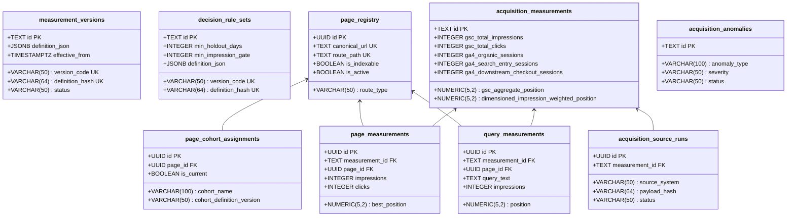

# Acquisition Learning System: PostgreSQL Schema Implementation Guide

**Phase:** Phase 3 (Canonical Data Layer, Database Implementation, Historical Migration, and Integrity Controls)  
**Date:** September 2, 2026  
**Status:** Approved & Applied to `nebula_platform`  
**Migration:** `0009_acquisition_data_layer`  

---

## 1. Executive Summary

This document describes the concrete PostgreSQL 16 schema implementation for the Acquisition Learning System in `nebula_platform` (port 5433). The data substrate consists of thirteen relational tables organized into three functional layers: Provenance & Rules, Core Measurements, and Change/Experiment Management.

---

## 2. Table Implementation Catalog

---

## 3. Detailed Table Specifications

### 3.1 Provenance & Governance Layer

1. **`measurement_versions`:**
   Stores immutable definitions of measurement calculations, filtering parameters, and metric versions with unique SHA-256 hashes. Protected by database trigger `trg_meas_versions_immutable`.
2. **`decision_rule_sets`:**
   Stores versioned decision-rule configurations, evidence eligibility gates (`min_holdout_days=28`, `min_impression_gate=100`), and action classes. Protected by `trg_decision_rules_immutable`.

### 3.2 Registry & Entity Identity Layer

3. **`page_registry`:**
   Maintains canonical identity for all site routes under domain `https://nebulacomponents.com`. Retains historical route identity across renames or retirements.
4. **`page_cohort_assignments`:**
   Maintains declarative cohort memberships (`problem_intent`, `commercial_comparison`, `category`, `vertical_use_case`, `resources`, `teardown_index`, `individual_teardown`, `case_study`, `product_core`, `checkout`, `utility_legal`, `other`).

### 3.3 Core Measurement Layer

5. **`acquisition_measurements`:**
   The master observation table storing sitewide macro metrics (`gsc_aggregate_position`, `dimensioned_impression_weighted_position`, `gsc_total_impressions`, `gsc_total_clicks`), position distributions, and 28-field metadata envelopes. Protected by `trg_acq_meas_immutable`.
6. **`acquisition_source_runs`:**
   Audit trail of individual source API calls (GSC, GA4) with response statuses, execution times, and payload SHA-256 hashes.
7. **`page_measurements`:**
   Durable per-page visibility and conversion snapshots. Protected by `trg_page_meas_immutable`.
8. **`query_measurements`:**
   Durable per-query rankings with explicit `is_anonymized_subset = TRUE` flag. Protected by `trg_query_meas_immutable`.
9. **`acquisition_state_transitions`:**
   Audit log of two-dimensional state movements across Search Visibility and Product Journey dimensions. Protected by `trg_state_trans_immutable`.

### 3.4 Operational, Anomaly & Experiment Layer

10. **`acquisition_anomalies`:**
    Structured registry for data irregularities and attribution behaviors (e.g. `anom_20260902_checkout_attribution` with status `KNOWN_ATTRIBUTION_BEHAVIOR`).
11. **`acquisition_changes`:**
    Records all deployed site modifications, content updates, and metadata changes linked to git commit hashes.
12. **`acquisition_experiments`:**
    Tracks formal hypotheses, target metrics, expected directions, and observation schedules.
13. **`experiment_evaluations`:**
    Records immutable post-holdout evaluations (`SUPPORTED`, `PARTIALLY_SUPPORTED`, `NOT_SUPPORTED`, `INCONCLUSIVE`, `CONFOUNDED`, `REGRESSED`).

---

## 4. Integration with Platform Event Ledger

`acquisition_measurements` operates side-by-side with the existing `analytics_event_ledger`:
- `analytics_event_ledger`: Real-time append-only stream of discrete visitor journey events (`audit_url_submitted`, `checkout_started`, `purchase_completed`).
- `acquisition_measurements`: Periodic aggregate batch observations from external search engines and channels.
- *Bridge:* Internal conversion totals in `acquisition_measurements` (`internal_audit_started`, `internal_purchases`) are computed directly from `analytics_event_ledger`.
