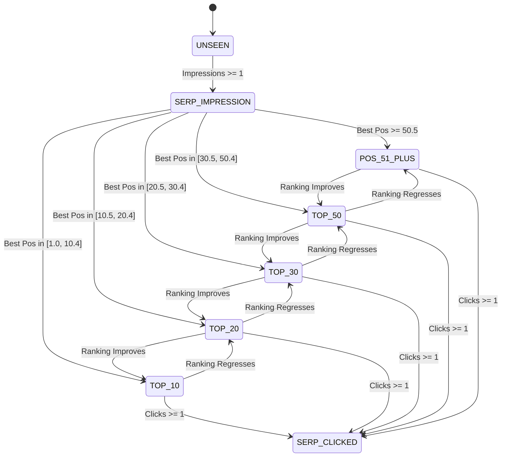
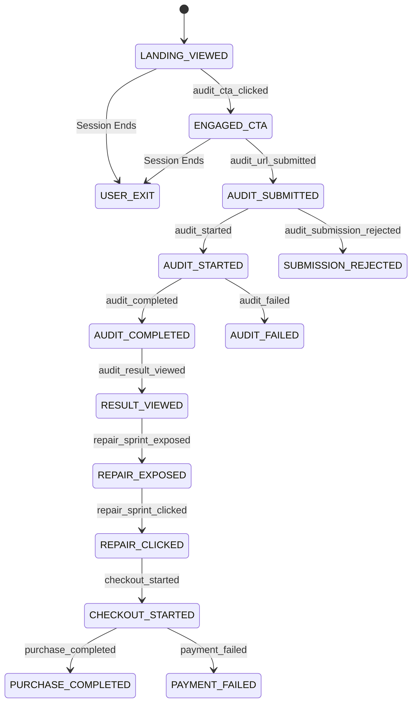

# Acquisition Learning System: Two-Dimensional State Machine & Transition Semantics

**Phase:** Phase 2 (Architecture, Measurement Model, State Machine, and Decision Semantics)  
**Date:** September 2, 2026  
**Status:** Approved Specification  
**Authority:** Technical Architecture & Governance  

---

## 1. Executive Summary & Dimensional Separation

A key architectural finding from Phase 1 is that search engine visibility and user product journey progression are fundamentally orthogonal:
- Search Visibility represents external SERP algorithmic exposure (impressions, positions, query presence).
- Product Journey represents visitor engagement, diagnostic execution, and commercial conversion.

Forcing both into a single linear progression (e.g. `TOP_10 -> AUDIT_COMPLETED`) destroys valid semantics because a page can achieve `TOP_10` visibility while having zero audit starts, or a low-ranking page (`POS_51_PLUS`) can generate highly qualified traffic that immediately completes audits.

Therefore, the Acquisition Learning System implements a **Two-Dimensional Decoupled State Architecture**.

---

## 2. Dimension 1: Search Visibility State Machine

Evaluated per (page, cohort) or (page, query) based on 28-day finalized GSC observation windows.

### 2.1 State Definitions & Exit Criteria

| State Name | Definition & Invariants | Entry Criteria (28-day Window) | Regression Trigger |
| :--- | :--- | :--- | :--- |
| `UNSEEN` | Page is published but has 0 recorded Google impressions. | $\text{impressions} = 0$ | N/A (Initial State) |
| `SERP_IMPRESSION` | Page has surfaced at least once on Google SERPs. | $\text{impressions} \ge 1$ | No regression to `UNSEEN` unless GSC data is invalidated. |
| `POS_51_PLUS` | Page ranks in deep SERP indexation ($> \text{page 5}$). | $\text{impressions} \ge 1 \land \text{best\_pos} \ge 50.5$ | Reclassification if rank improves. |
| `TOP_50` | Page is in striking distance of page 3 ($31 \le \text{pos} \le 50$). | $30.5 \le \text{best\_pos} \le 50.4$ | $\text{best\_pos} \ge 50.5$ |
| `TOP_30` | Page is on page 3 of Google search results ($21 \le \text{pos} \le 30$). | $20.5 \le \text{best\_pos} \le 30.4$ | $\text{best\_pos} \ge 30.5$ |
| `TOP_20` | Page is on page 2 of Google search results ($11 \le \text{pos} \le 20$). | $10.5 \le \text{best\_pos} \le 20.4$ | $\text{best\_pos} \ge 20.5$ |
| `TOP_10` | Page is on page 1 of Google search results ($1 \le \text{pos} \le 10$). | $1.0 \le \text{best\_pos} \le 10.4$ | $\text{best\_pos} \ge 10.5$ |
| `SERP_CLICKED` | Page generated at least 1 verified search click in the window. | $\text{clicks} \ge 1$ | $\text{clicks} = 0$ in subsequent window. |

---

## 3. Dimension 2: Product Journey State Machine

Evaluated per visitor journey (`journey_id`) and aggregated to landing pages via `analytics_event_ledger`.

### 3.1 State Definitions

| State Name | Canonical Event Trigger | Counting & Attribution Rule |
| :--- | :--- | :--- |
| `LANDING_VIEWED` | `landing_page_view` | Attributed to initial `landing_path`. |
| `ENGAGED_CTA` | `audit_cta_clicked` | Attributed to origin page. |
| `AUDIT_SUBMITTED`| `audit_url_submitted` | Distinct `audit_attempt_id`. |
| `AUDIT_STARTED`  | `audit_started` | Distinct `audit_id`. |
| `AUDIT_COMPLETED`| `audit_completed` | Distinct `audit_id` with score and grade. |
| `RESULT_VIEWED`  | `audit_result_viewed` | Distinct `audit_id` viewed in browser. |
| `REPAIR_EXPOSED` | `repair_sprint_exposed`| Viewport visibility of $97 Fix Pack offer. |
| `CHECKOUT_STARTED`| `checkout_started` | Created Stripe checkout session. |
| `PURCHASE_COMPLETED`| `purchase_completed` | Verified payment provider webhook. |

---

## 4. State Tracking Invariants & Rules

### 4.1 Current State vs Best-Ever State
For every entity in `page_registry`:
- `current_visibility_state`: The state calculated for the most recent finalized observation window ($[T-31, T-3]$).
- `best_ever_visibility_state`: The highest historical visibility state achieved by the page.
- *Invariant:* A decline in ranking changes `current_visibility_state` to a lower tier but does not alter `best_ever_visibility_state`.

### 4.2 Handling Missing Data & Zero Observations
- If an ingestion run returns zero rows for a previously ranking page (due to API timeout or transient GSC drop), the system marks the snapshot status as `INCOMPLETE` or `DATA_GAP`.
- *Invariant:* Missing data does **not** automatically trigger a state regression. Regressions require a validated `COMPLETE` measurement showing degraded metrics.

### 4.3 Transition Audit Log
Every state movement is immutably logged to `acquisition_state_transitions`:
- `page_id`
- `measurement_id`
- `dimension` (`search_visibility` or `product_journey`)
- `from_state`
- `to_state`
- `transition_type` (`PROGRESSION`, `REGRESSION`, `MAINTAINED`, `INITIAL`)
- `transition_reason` (e.g. `best_pos improved from 34.2 to 18.5`)
- `occurred_at`
