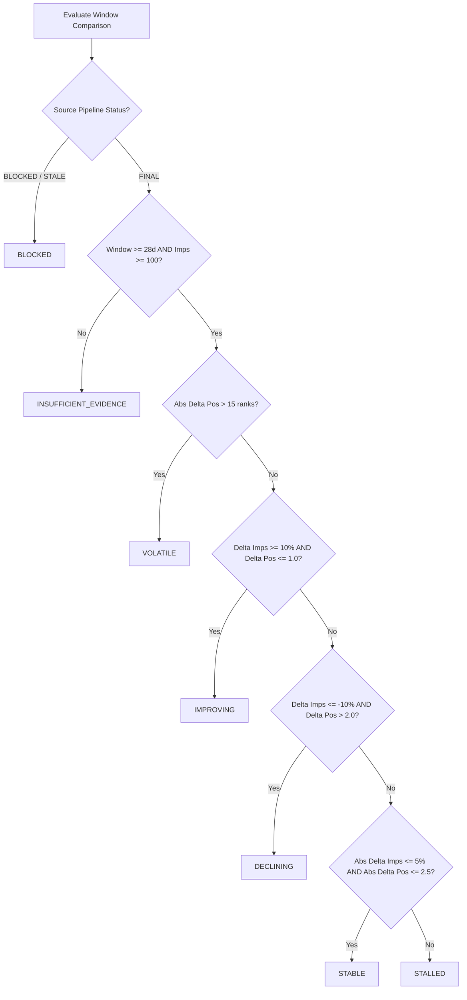

# Acquisition Learning System: Deterministic Trend Classification Engine

**Phase:** Phase 4 (Automated Ingestion, Route Synchronization, Rolling Windows, State Evaluation, and Trend Computation)  
**Date:** September 2, 2026  
**Status:** Approved & Implemented  
**Execution Script:** `scripts/acquisition/trend_engine.py`  
**Database:** `nebula_platform` (PostgreSQL 16 on port 5433)  

---

## 1. Executive Summary

This document specifies the deterministic, rules-based trend classification engine. The system rejects black-box LLM estimations and subjective interpretations, evaluating trends through mathematical deltas, evidence eligibility gates, and explicit classification trees.

---

## 2. Trend Classification State Space

| Trend Classification | Mathematical / Evidence Rule | Operational Action |
| :--- | :--- | :--- |
| `IMPROVING` | Impressions up $\ge 10\%$ and macro rank improves or holds ($\Delta \text{pos} \le 1.0$). | Maintain momentum; protect high-performing pages. |
| `DECLINING` | Impressions down $\ge 10\%$ and macro rank regresses ($\Delta \text{pos} > 2.0$). | Flag for diagnostic query and indexing review. |
| `STABLE` | Metrics remain within statistical noise band ($|\Delta \text{imps}| \le 5\%$, $|\Delta \text{pos}| \le 2.5$). | Maintain observation holdout. |
| `VOLATILE` | Position jumps by $> 15.0$ ranks without proportional impression changes. | Monitor for algorithmic search turbulence. |
| `STALLED` | Sustained impressions with zero clicks or conversions over consecutive windows. | Evaluate SERP presentation and title copy. |
| `INSUFFICIENT_EVIDENCE` | Observation window $< 28\text{ days}$ or total impressions $< 100$. | Hold; data not yet eligible for trend claims. |
| `BLOCKED` | Source API failed, token expired, or unfinalized data lag violated. | Alert operator; repair data pipeline. |

---

## 3. Evaluation Decision Tree

