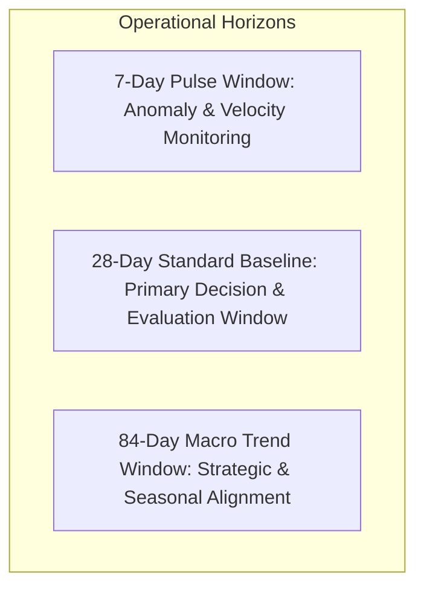

# Acquisition Learning System: Rolling Windows, Concentration & Query Intelligence

**Phase:** Phase 4 (Automated Ingestion, Route Synchronization, Rolling Windows, State Evaluation, and Trend Computation)  
**Date:** September 2, 2026  
**Status:** Approved & Implemented  
**Execution Script:** `scripts/acquisition/window_computation.py`  
**Database:** `nebula_platform` (PostgreSQL 16 on port 5433)  

---

## 1. Executive Summary

This document specifies the rolling observation window hierarchy, comparison vector mechanics, impression concentration metrics, and query intelligence indicators for the Acquisition Learning System.

---

## 2. Rolling Window Hierarchy

| Window Type | Duration | Finalization Offset | Purpose & Canonical Usage |
| :--- | :--- | :--- | :--- |
| **Pulse Window** | 7 Days | $[T-10, T-3]$ | Rapid detection of indexing outages, sharp CTR drops, or sudden search spikes. |
| **Standard Baseline** | 28 Days | $[T-31, T-3]$ | Primary decision window for evidence sufficiency gates and experiment holdouts. |
| **Macro Trend** | 84 Days | $[T-87, T-3]$ | Multi-month strategic review, cohort lifecycle evolution, and algorithmic shift analysis. |

---

## 3. Impression Concentration Metrics

To ensure that acquisition growth is structural across the site rather than driven entirely by an isolated viral page or single query, the system calculates concentration indices:

$$\text{top\_1\_page\_share} = \frac{\text{Impressions}_{\text{top\_1}}}{\text{Total Sitewide Impressions}}$$
$$\text{top\_5\_page\_share} = \frac{\sum_{i=1}^5 \text{Impressions}_i}{\text{Total Sitewide Impressions}}$$
$$\text{top\_10\_page\_share} = \frac{\sum_{i=1}^{10} \text{Impressions}_i}{\text{Total Sitewide Impressions}}$$

---

## 4. Query Intelligence Substrate

1. **`new_query`:** Queries appearing in the current finalized window that had 0 impressions in the previous comparison window.
2. **`lost_query`:** Queries present in the comparison window that generated 0 impressions in the current window.
3. **`POTENTIAL_CANNIBALIZATION`:** Detected when two or more distinct canonical URLs generate impressions for the exact same search query within the same observation period.
